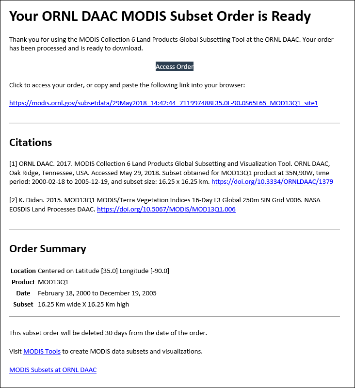

# Submit a batch of MODIS Global Subset Tool orders via the MODIS Web Service

*Author: ORNL DAAC*  
*Date: May 29, 2018*  
*Contact for ORNL DAAC: uso@daac.ornl.gov*  

### Keywords: MODIS, web service, Python, R, REST

## Overview

The tutorials in the two jupyter notebooks demonstrate how to submit a batch of orders to the [MODIS Global Subset Tool](https://modis.ornl.gov/cgi-bin/MODIS/global/subset.pl) for a list of coordinates in a text file using the MODIS Web Services API maintained by the ORNL DAAC. For a full description and usage examples of the web service, please visit the ORNL DAAC's MODIS: https://modis.ornl.gov/data/modis_webservice.html

## Tutorials
* Python: [modis_global_api_access_python.ipynb](modis_global_api_access_python.ipynb)
* R: Coming soon

## Prerequisites:
* Python 2 or 3, Libraries: requests, pandas, json, datetime **OR**
* R (3.x recommended). R libraries: httr, readr, jsonlite
* An input text file formatted as follows:
```
site_id,product,latitude,longitude,email,start_date,end_date,kmAboveBelow,kmLeftRight
site1,MOD13Q1,35.0,-90.0,mcnelisjj@ornl.gov,2000-01-01,2005-12-31,8,8
site2,MOD13Q1,40.0,-95.0,mcnelisjj@ornl.gov,2000-01-01,2005-12-31,8,8
site3,MOD13Q1,45.0,-100.0,mcnelisjj@ornl.gov,2000-01-01,2005-12-31,8,8
site4,MOD13Q1,50.0,-105.0,mcnelisjj@ornl.gov,2000-01-01,2005-12-31,8,8
site5,MOD13Q1,55.0,-110.0,mcnelisjj@ornl.gov,2000-01-01,2005-12-31,8,8
```
You can of course format your input file however best suits your needs; e.g. the product, email, start_date, end_date, kmAboveBelow, and kmLeftRight are redundant in the notebooks examples and could be excluded.



Figure 1. Example order delivery email
